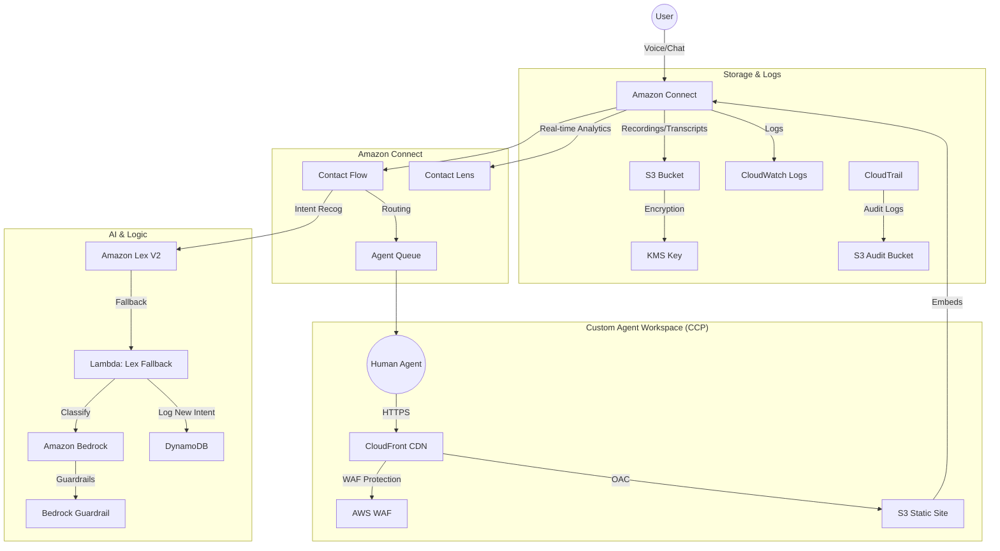

# Connect Comprehensive Stack Architecture

This stack deploys a resilient, secure, and observable Amazon Connect contact center solution with advanced AI capabilities and a custom, secure Agent Workspace.

## Architecture Diagram



### ASCII Architecture Diagram

```
                                       +-----------------------------------------------------------------------+
                                       |                       AWS Cloud (Zero Trust)                          |
                                       |                                                                       |
      +--------+                       |   +-------------------+       +-----------------------------------+   |
      |        |   Voice / Chat        |   |                   |       |          Observability            |   |
      |  User  +-------------------------->+   Amazon Connect  +------>+  CloudWatch Logs / Contact Lens   |   |
      |        |                       |   |                   |       |  (Real-time Sentiment/Scribe)     |   |
      +--------+                       |   +---------+---------+       +-----------------------------------+   |
                                       |             |                                                         |
                                       |             v                                                         |
                                       |   +---------+---------+                                               |
                                       |   |                   |                                               |
                                       |   |   Contact Flow    |                                               |
                                       |   |                   |                                               |
                                       |   +----+-------+------+                                               |
                                       |        |       |                                                      |
                                       |        |       +----------------------------------+                   |
                                       |        v                                          |                   |
                                       |   +----+----+    Fallback (Unrecognized)    +-----+------+            |
                                       |   |         +------------------------------>+            |            |
                                       |   | Lex V2  |                               |   Lambda   |            |
                                       |   |         +<------------------------------+ (Fallback) |            |
                                       |   +---------+      Delegate (Recognized)    +-----+------+            |
                                       |                                                   |                   |
                                       |                                                   v                   |
                                       |                                         +---------+---------+         |
                                       |                                         |                   |         |
                                       |                                         |  Amazon Bedrock   |         |
                                       |                                         | (Classification)  |         |
                                       |                                         |                   |         |
                                       |                                         +---------+---------+         |
                                       |                                                   |                   |
                                       |                                                   v                   |
                                       |                                         +---------+---------+         |
                                       |                                         | Bedrock Guardrail |         |
                                       |                                         | (Content Mod.)    |         |
                                       |                                         +-------------------+         |
                                       |                                                                       |
                                       |                                                                       |
                                       |   +-------------------+       +-----------------------------------+   |
                                       |   |                   |       |                                   |   |
                                       |   |    Agent Queue    |<------+      DynamoDB (New Intents)       |   |
                                       |   |                   |       |                                   |   |
                                       |   +---------+---------+       +-----------------------------------+   |
                                       |             |                                                         |
                                       |             v                                                         |
      +--------+                       |   +---------+---------+       +-----------------------------------+   |
      |        |   HTTPS (WAF)         |   |                   |       |                                   |   |
      | Agent  +<--------------------------+   Human Agent     |       |    S3 (Recordings/Transcripts)    |   |
      |        |   Custom CCP          |   |                   |       |          (KMS Encrypted)          |   |
      +--------+                       |   +-------------------+       +-----------------------------------+   |
                                       |                                                                       |
                                       +-----------------------------------------------------------------------+
```

## Components

1.  **Amazon Connect**: The core contact center service.
    -   **Contact Flows**: Defines the customer journey (IVR/Chat).
    -   **Queues**: Routes contacts to agents.
    -   **Contact Lens**: Provides real-time sentiment analysis and voice transcription (Scribe).
2.  **Amazon Lex V2**: Handles conversational AI for both voice and chat.
    -   **Intents**: Pre-defined user intents.
    -   **Fallback**: Triggers Lambda when intent is not recognized.
3.  **AWS Lambda (Lex Fallback)**:
    -   Receives unrecognized utterances from Lex.
    -   Calls **Amazon Bedrock** to classify the intent using a Large Language Model (LLM).
    -   If classified as a known intent, delegates back to Lex.
    -   If classified as "New Intent", logs it to **DynamoDB** for analysis and informs the user.
    -   If unclassifiable or high urgency, routes to a human agent.
4.  **Amazon Bedrock**:
    -   Uses Foundation Models (e.g., Claude, Titan) for advanced intent classification.
    -   **Guardrails**: Ensures content moderation (hate speech, PII, etc.) on inputs and outputs.
5.  **Amazon S3**:
    -   Stores call recordings and chat transcripts.
    -   Encrypted using KMS.
6.  **AWS KMS**:
    -   Provides customer-managed keys for encryption at rest (Zero Trust).
7.  **DynamoDB**:
    -   Stores "New Intents" discovered by Bedrock for future training of the Lex bot.
8.  **Observability**:
    -   CloudWatch Logs for Lambda and Connect.
    -   Contact Lens for real-time analytics.

## Zero Trust & Security
-   **Encryption**: All data at rest (S3, DynamoDB) is encrypted with KMS.
-   **Least Privilege**: IAM roles for Lambda and Lex are scoped to minimum necessary permissions.
-   **Guardrails**: Bedrock Guardrails prevent harmful content processing.

## User & Agent Flow
1.  **User** initiates a call or chat.
2.  **Connect** triggers the **Contact Flow**.
3.  **Lex** attempts to understand the user.
4.  If successful, Lex fulfills the request or collects info.
5.  If unsuccessful, **Lambda** + **Bedrock** analyze the input.
6.  If a human is needed, the contact is routed to the **Agent Queue**.
7.  **Agent** accepts the contact via the CCP (Contact Control Panel) with full context.
8.  **Contact Lens** analyzes sentiment and transcribes voice in real-time.
