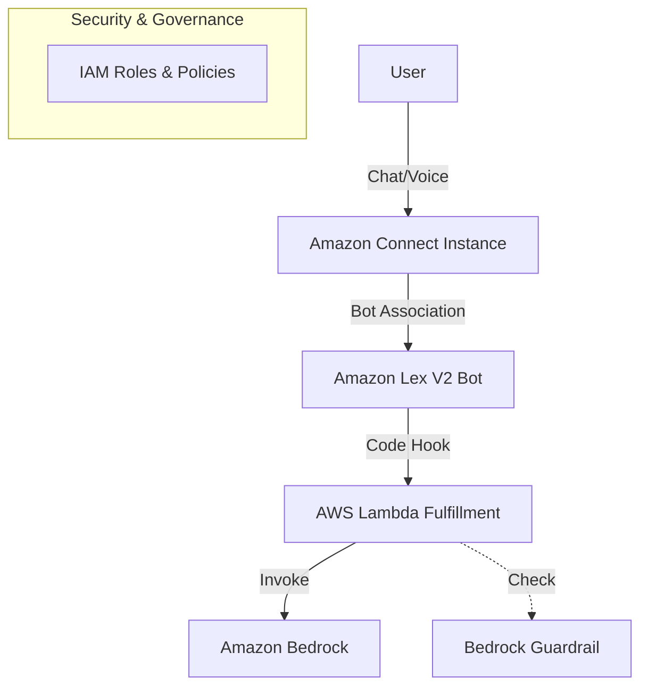

# Amazon Connect Chatbot with Lex and Bedrock Architecture

## Overview
This architecture deploys an intelligent contact center solution using Amazon Connect, integrated with an Amazon Lex V2 bot for conversational capabilities. The Lex bot utilizes AWS Lambda for fulfillment, which is empowered with Amazon Bedrock Guardrails for content moderation and safety.

## Architecture Diagram

## Components

### 1. Amazon Connect
*   **Resource**: `aws_connect_instance`
*   **Purpose**: Entry point for customer interactions (Chat/Voice).
*   **Configuration**:
    *   Inbound/Outbound calls enabled.
    *   Contact Lens enabled for analytics.
    *   Identity Management: Connect Managed.

### 2. Amazon Lex V2
*   **Resource**: `aws_lexv2models_bot`, `awscc_lex_bot_alias`
*   **Purpose**: Natural Language Understanding (NLU) and conversational interface.
*   **Configuration**:
    *   **Intents**: `ChatIntent`, `FallbackIntent`.
    *   **Alias**: `prod` (Managed via Cloud Control API).
    *   **Integration**: Associated with the Connect instance.

### 3. AWS Lambda (Fulfillment)
*   **Resource**: `aws_lambda_function`
*   **Purpose**: Business logic execution and integration bridge.
*   **Runtime**: Node.js 18.x.
*   **Permissions**:
    *   `bedrock:InvokeModel`: To interact with generative AI models.
    *   Logging to CloudWatch.

### 4. Amazon Bedrock Guardrail
*   **Resource**: `aws_bedrock_guardrail`
*   **Purpose**: Enforces safety and content moderation policies.
*   **Policies**:
    *   **Content Filters**: High strength filters for Hate, Insults, Sexual, and Violence.
    *   **Topic Policy**: Denies "FinancialAdvice".

## Data Flow
1.  **Interaction Start**: User initiates a chat or call via Amazon Connect.
2.  **Bot Handover**: Connect routes the interaction to the associated Lex Bot (`prod` alias).
3.  **Intent Recognition**: Lex analyzes the user input to determine the intent.
4.  **Fulfillment**:
    *   Lex invokes the **Lambda Function** via the configured Code Hook.
    *   The Lambda function can invoke **Amazon Bedrock** models to generate responses.
    *   **Bedrock Guardrails** are applied to ensure the content is safe and adheres to policies.
5.  **Response**: The generated (and guarded) response is returned to Lex, then to Connect, and finally to the user.

## Infrastructure Validation
The Terraform configuration has been validated to ensure all components are correctly defined and linked:
*   ✅ **Connect-Lex Association**: The `aws_connect_bot_association` resource is defined to link the Connect Instance ID with the Lex Bot Alias ARN.
*   ✅ **Lex-Lambda Link**: The `awscc_lex_bot_alias` is configured with the Lambda ARN for code hooks.
*   ✅ **Lambda-Bedrock Permissions**: The Lambda IAM role includes `bedrock:InvokeModel` permissions.
*   ✅ **Provider Compatibility**: The solution uses a hybrid provider approach (`hashicorp/aws` and `hashicorp/awscc`) to bridge gaps in the standard provider coverage for Lex V2 aliases.

## Real-time Content Moderation Validation
The architecture ensures real-time content moderation for both **Voice** and **Chat** channels through the following synchronous flow:

1.  **Input Processing**:
    *   **Chat**: User text is passed directly to Lex.
    *   **Voice**: User speech is transcribed to text by Lex in real-time.
2.  **Synchronous Hook**: Lex invokes the AWS Lambda function *before* generating a final response.
3.  **Guardrail Enforcement**:
    *   The Lambda function calls `BedrockRuntime.InvokeModel` with the `guardrailIdentifier`.
    *   **Input Validation**: Bedrock evaluates the user's input (transcript) against the configured policies (Hate, Insults, Sexual, Violence, Financial Advice). If a violation occurs, the model invocation is blocked immediately.
    *   **Output Validation**: If the input passes, the model generates a response. This response is *also* evaluated against the Guardrail.
4.  **Immediate Action**:
    *   If a violation is detected (Input or Output), the Lambda catches the exception/intervention and returns a pre-configured "safe" message to Lex.
    *   This prevents harmful content from ever reaching the user (Chat) or being spoken back (Voice).
