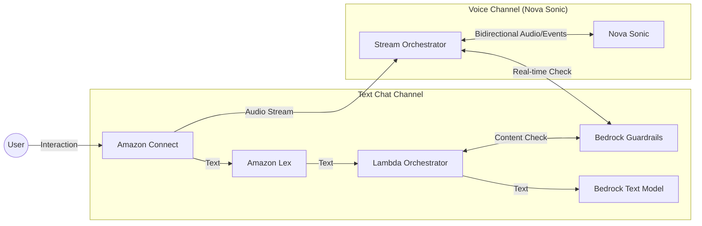

# Amazon Nova Sonic: Revolutionizing Contact Center Conversations

## Executive Summary
This paper explores the integration of **Amazon Nova Sonic**, a next-generation multimodal (Speech-to-Speech) AI model, into the existing Amazon Connect and Lex architecture. By utilizing a unified speech understanding and generation architecture, Nova Sonic addresses critical latency, expressiveness, and complexity challenges inherent in traditional Speech-to-Text (STT) and Text-to-Speech (TTS) pipelines.

## Current Architecture Limitations
The current architecture relies on a multi-step pipeline for voice interactions:
1.  **Speech-to-Text (STT)**: Amazon Lex transcribes user audio to text.
2.  **Processing**: Text is sent to AWS Lambda and then to Amazon Bedrock (LLM).
3.  **Text-to-Speech (TTS)**: The text response is converted back to audio by Amazon Polly (via Lex).

### Issues with the Current Approach
*   **Latency**: Each conversion step (Audio $\to$ Text $\to$ LLM $\to$ Text $\to$ Audio) introduces processing delay, resulting in "pauses" that break conversational flow.
*   **Loss of Paralinguistics**: Transcription strips away tone, pitch, urgency, and emotion. A frustrated customer saying "Great, thanks" is transcribed identically to a happy customer, potentially leading to inappropriate AI responses.
*   **Robotic Delivery**: While TTS engines are advanced, they often lack the dynamic emotional range required to match the user's state (e.g., empathy during a fraud alert).

## Architecture Evolution & Comparison

Integrating Amazon Nova Sonic introduces a parallel processing path optimized for voice, while retaining the robust Lex-based architecture for text chat and flow control.

### 1. Current Architecture (Text-Based Pipeline)
The current system forces all interactions through a text-conversion bottleneck.

```mermaid
graph LR
    User((User)) -->|Voice/Text| Connect[Amazon Connect]
    Connect --> Lex[Amazon Lex]
    Lex -->|Text| Lambda[Lambda Orchestrator]
    Lambda <-->|Content Check| Guardrails[Bedrock Guardrails]
    Lambda -->|Text| Bedrock[Bedrock LLM]
    Bedrock -->|Text| Lambda
    Lambda -->|Text| Lex
    Lex -->|Audio (Polly)| Connect
```

### 2. Proposed Architecture (Hybrid Multimodal)
The new architecture introduces a **Bidirectional Streaming** path for voice, while preserving the Lex flow for text chat.



### Key Architectural Features

#### Unified Content Moderation
Safety remains a priority across both channels.
*   **Text Path**: Continues to use Bedrock Guardrails to filter text inputs and outputs within the Lambda function.
*   **Voice Path**: The Stream Orchestrator intercepts text transcript events (emitted by Nova Sonic alongside audio) and applies the same **Bedrock Guardrails** policies in real-time. If a violation is detected, the audio stream is interrupted, and a fallback message is played.

#### Hybrid Flow Control
*   **Chat Continuity**: Text-based interactions (Web/SMS) continue to utilize **Amazon Lex**. This ensures that existing investments in Lex intents, slot filling, and Connect flows are preserved for non-voice channels.
*   **Connect Integration**: Amazon Connect remains the central contact center controller. It routes voice calls to the Nova Sonic stream and text chats to Lex based on the contact type, ensuring a seamless experience across modalities.

## Key Benefits & Issues Solved

### 1. Ultra-Low Latency & Concurrent Processing
*   **Benefit**: Nova Sonic generates responses *while* processing input, without waiting for complete utterances.
*   **Issue Solved**: Eliminates the awkward 2-3 second silence ("turn-taking latency") between a user finishing a sentence and the bot responding. The interaction feels immediate and fluid.

### 2. Adaptive Prosody & Emotional Intelligence
*   **Benefit**: The model dynamically adjusts its delivery based on the **prosody** (rhythm, stress, and intonation) of the input speech. It supports expressive voices in multiple languages (English, French, Italian, German, Spanish).
*   **Issue Solved**: Solves the "Tone Deaf AI" problem. If a user sounds panicked, Nova Sonic detects the urgency and responds with a calming, reassuring tone rather than a standard cheerful default voice.

### 3. Advanced Interruption Handling
*   **Benefit**: The model is designed to handle user interruptions gracefully without dropping conversational context.
*   **Issue Solved**: Prevents the bot from "talking over" the user or losing track of the conversation when the user barges in to correct or redirect the flow.

### 4. Knowledge Grounding (RAG) & Tool Use
*   **Benefit**: Unlike basic voice models, Nova Sonic supports **Retrieval Augmented Generation (RAG)** with enterprise data and **Function Calling** (Agentic Workflows).
*   **Issue Solved**: Enables the voice agent to perform real actions (e.g., "Check my balance", "Transfer funds") and answer complex queries based on private data, not just chat.

### 5. Robustness to Real-World Noise
*   **Benefit**: The model is engineered to be robust against background noise.
*   **Issue Solved**: Ensures reliable performance in noisy environments (e.g., busy streets, call centers) where traditional STT often fails.

## Conclusion
Adding **Amazon Nova Sonic** to the architecture transforms the solution from a "Voice-Enabled Chatbot" to a true "AI Voice Agent." It bridges the gap between automated systems and human agents by understanding not just *what* is said, but *how* it is said, delivering faster, more empathetic, and more effective customer service through a unified, low-latency streaming interface.
