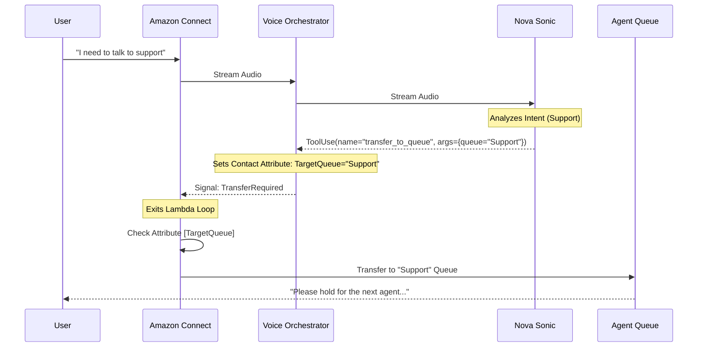
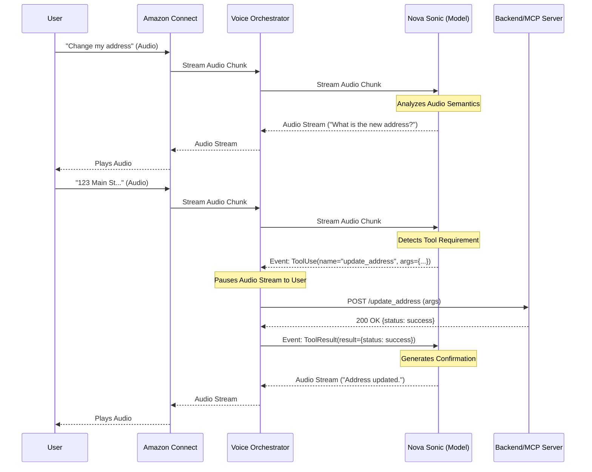

# Nova Sonic Intent Recognition & Fulfillment Flow

## Overview
Unlike traditional slot-filling bots (like Amazon Lex) that rely on pre-defined utterances and rigid state machines, **Amazon Nova Sonic** utilizes a **Generative AI "Audio-to-Action"** paradigm. It understands intent semantically from the raw audio stream and executes fulfillment through **Tool Use (Function Calling)**.

This document details how Nova Sonic handles a complex transactional request—changing a user's address—by integrating with backend systems (or MCP Servers) via the Voice Orchestrator.

## Complete System Architecture

The following diagram illustrates the end-to-end hybrid architecture, highlighting the parallel paths for Text (Lex) and Voice (Nova Sonic), the unified Guardrails, the shared Context State, the Feedback Loop, and the integration with **Agent Queues** for human handoff.

```text
+---------------------------------------------------------------------------------------------------------------+
|                                          AWS Cloud Environment                                                |
+---------------------------------------------------------------------------------------------------------------+
|                                                                                                               |
|   +--------+                                       +------------------+         +---------------------+       |
|   |  User  |<=====================================>|  Amazon Connect  |-------->|    Agent Queues     |       |
|   +--------+       Voice / Chat                    +---------+--------+         | (Sales, Support...) |       |
|                                                              |                  +----------+----------+       |
|                                                              | Routing / Fallback          |                  |
|                                                              v                             v                  |
|                                                    +---------+--------+             +------+------+           |
|                                                    |   Contact Flow   |             | Human Agent |           |
|                                                    +----+--------+----+             +-------------+           |
|                                                         |        |                                            |
|                             Text Chat / Fallback Path   |        |      Voice Path (Nova Sonic)               |
|                      +----------------------------------+        +-----------------------------+              |
|                      |                                                                         |              |
|                      v                                                                         v              |
|             +--------+--------+                                                       +--------+-----+------+ |
|             |  Amazon Lex V2  |                                                       |    Voice Lambda     | |
|             |   (NLU/Slots)   |                                                       | (Stream Orchestrator)| |
|             +--------+--------+                                                       +--------+-----+------+ |
|                      |                                                                         ^     |        |
|                      v                                                                         |     |        |
|             +--------+--------+                                                                |     |        |
|             |   Chat Lambda   |<---------------------------------------------------------------+     |        |
|             |  (Fulfillment)  |             (Context Handoff via DynamoDB)                     |     |        |
|             +--------+--------+                                                                |     |        |
|                      |    |                                                                    |     |        |
|                      |    +--------------------------------------------------------+           |     |        |
|                      v                                                             v           |     |        |
|             +--------+--------+        +---------------------+                        +--------+-----+------+ |
|             | Bedrock (Text)  |<------>|  Bedrock Guardrails |<---------------------->|     Nova Sonic      | |
|             | (Claude Haiku)  |        | (Safety/Moderation) |                        |    (Audio Model)    | |
|             +-----------------+        +---------------------+                        +---------------------+ |
|                                                                                                               |
|                                                                                                               |
|      +-----------------------+                                                                                |
|      |   DynamoDB (Context)  |<------------------------------------------------------------------------+      |
|      |   (Session State)     |<----------------------------------------+                               |      |
|      +-----------------------+                                         |                               |      |
|                                                                        |                               |      |
|      +-----------------------+                                         |                               |      |
|      |   MCP Server Lambda   |<----------------------------------------+                               |      |
|      |   (Backend Tools)     |<------------------------------------------------------------------------+      |
|      +-----------------------+                                                                                |
|                                                                                                               |
+---------------------------------------------------------------------------------------------------------------+
|                                   Observability & Feedback Loop                                               |
+---------------------------------------------------------------------------------------------------------------+
|                                                                                                               |
|  +--------------+       +--------------+        +--------------+        +------------------+                  |
|  |  CloudWatch  |       |  S3 Bucket   |        |   DynamoDB   |        | Bedrock Training |                  |
|  |     Logs     |       | (Audit/Logs) |<------>|  (Feedback)  |------->|   (Fine-Tuning)  |                  |
|  +--------------+       +--------------+        +--------------+        +------------------+                  |
|                                                                                                               |
+---------------------------------------------------------------------------------------------------------------+
```

## The "Audio-to-Action" Paradigm

1.  **Semantic Intent Recognition**: Nova Sonic does not classify text into static intent categories (e.g., `ChangeAddressIntent`). Instead, it uses its LLM capabilities to understand the *meaning* of the user's speech in context.
2.  **Dynamic Slot Elicitation**: If information is missing, the model naturally generates a follow-up question based on the tool definition, without needing a hardcoded dialogue flow.
3.  **Tool Execution**: When the model has sufficient information, it pauses audio generation and emits a structured **Tool Use Event**. The Orchestrator Lambda executes this tool and returns the result.

## Human Handover Protocol

To ensure a seamless customer experience, the Voice Orchestrator implements a "Human in the Loop" protocol.

1.  **Detection**: The Nova Sonic model is instructed via a System Prompt to detect when a user explicitly requests a human agent or when the conversation exceeds its capabilities.
2.  **Signaling**: Instead of generating audio, the model outputs a special control tag: `[HANDOVER: DepartmentName]`.
3.  **Orchestration**:
    *   The Voice Lambda parses the stream for this tag.
    *   It resolves the `DepartmentName` to a specific Amazon Connect Queue ARN using the `QUEUE_MAP` environment variable.
    *   It returns a structured `transfer` action to the Amazon Connect instance.
4.  **Execution**: Amazon Connect terminates the Lambda loop and transfers the contact to the specified queue.

## Process Flow Example: "I want to change my address"

### Scenario
*   **User**: "I need to update my billing address."
*   **System**: Authenticates user, collects new address, updates backend via POST, and confirms.

### Step-by-Step Execution

#### 1. Intent Detection & Parameter Collection
*   **User Audio**: *"Hi, I moved recently and need to change my address."*
*   **Nova Sonic (Internal Thought)**: User wants to perform action `update_address`. I need `street`, `city`, `zip`.
*   **Nova Sonic (Audio Output)**: *"I can help with that. What is your new street address?"*
*   **User Audio**: *"It's 123 Main Street, Seattle."*
*   **Nova Sonic (Internal Thought)**: I have `street` ("123 Main Street") and `city` ("Seattle"). I still need `zip_code`.
*   **Nova Sonic (Audio Output)**: *"Got it. And the zip code?"*
*   **User Audio**: *"98101."*

#### 2. Tool Selection & Invocation
*   **Nova Sonic (Internal Thought)**: I have all required parameters for the `update_address` tool.
*   **Nova Sonic Action**: Stops generating audio. Emits a `ToolUse` event in the bidirectional stream.
    ```json
    {
      "type": "tool_use",
      "toolUseId": "tool_u12345",
      "name": "update_address",
      "input": {
        "street": "123 Main Street",
        "city": "Seattle",
        "zip_code": "98101"
      }
    }
    ```

#### 3. Orchestrator & MCP Execution
*   **Voice Orchestrator (Lambda)**:
    1.  Receives the `tool_use` event.
    2.  Maps `update_address` to a specific backend API or **MCP Server Tool**.
    3.  Executes the operation (e.g., `POST /api/customer/address`).
    4.  Receives response: `{"status": "success", "updated_at": "2025-12-01"}`.
    5.  Sends a `ToolResult` event back into the Nova Sonic stream.
    ```json
    {
      "type": "tool_result",
      "toolUseId": "tool_u12345",
      "content": [
        { "json": { "status": "success" } }
      ]
    }
    ```

#### 4. Final Confirmation
*   **Nova Sonic**: Receives the tool result.
*   **Nova Sonic (Audio Output)**: *"Done. I've updated your address to 123 Main Street, Seattle. Is there anything else?"*

### Fallback Scenario: Nova Sonic Failure

If the Nova Sonic model becomes unavailable or returns an error during the conversation, the system automatically degrades to the standard Amazon Lex V2 path while preserving context.

#### 1. Error Detection & Context Save
*   **Voice Orchestrator**: Detects a timeout or 5xx error from the Nova Sonic stream.
*   **Action**:
    1.  Captures the current session state (e.g., `intent: update_address`, `slots: {street: '123 Main St'}`).
    2.  Writes this state to the **DynamoDB Context Table** with a TTL.
    3.  Returns a specific error signal to Amazon Connect.

#### 2. Routing to Fallback
*   **Amazon Connect**: Receives the error signal.
*   **Contact Flow**: Transitions from the "Invoke AWS Lambda" block to the **Error** path.
*   **Action**: Plays a message: *"I'm having trouble hearing you clearly. Let me switch you to our secure automated system."*
*   **Handoff**: Transfers control to the **Amazon Lex V2** bot.

#### 3. Context Restoration & Fulfillment
*   **Amazon Lex**: Invokes the **Chat Fulfillment Lambda** (Code Hook).
*   **Chat Lambda**:
    1.  Checks the **DynamoDB Context Table** using the `ContactId`.
    2.  Retrieves the saved state (`intent: update_address`).
    3.  Pre-fills the Lex slots.
*   **Result**: The user continues exactly where they left off, interacting with Lex (Text-to-Speech) instead of Nova Sonic, but with the same backend capabilities (MCP Tools) and safety checks (Guardrails).

## Intelligent IVR & Agent Routing

This architecture replaces traditional DTMF menus ("Press 1 for Sales") with a **Natural Language IVR** powered by Nova Sonic.

### 1. Nova Sonic as the IVR
Instead of navigating a tree, the user simply states their intent. Nova Sonic classifies this intent and uses a specific tool to signal Amazon Connect to transfer the call.

*   **Tool Definition**: `transfer_to_queue`
    ```json
    {
      "name": "transfer_to_queue",
      "description": "Transfers the user to a human agent queue based on their request.",
      "inputSchema": {
        "type": "object",
        "properties": {
          "queue_name": { 
            "type": "string", 
            "enum": ["Sales", "Support", "Billing", "General"] 
          },
          "reason": { "type": "string" }
        },
        "required": ["queue_name"]
      }
    }
    ```

### 2. Routing Logic (Voice Path)
1.  **User**: "I'd like to speak to someone about buying a new policy."
2.  **Nova Sonic**: Identifies intent as `Sales`.
3.  **Action**: Calls tool `transfer_to_queue(queue_name="Sales", reason="New Policy")`.
4.  **Voice Orchestrator**:
    *   Receives the tool call.
    *   Sets a **Contact Attribute** in Amazon Connect (e.g., `TargetQueue = "Sales"`).
    *   Returns a specific signal to the Contact Flow (e.g., `TransferRequired`).
5.  **Contact Flow**:
    *   Checks the `TargetQueue` attribute.
    *   Executes the **Transfer to Queue** block.
    *   The user is placed in the "Sales" queue for the next available agent.

### 3. Fallback IVR (Lex + Polly)
If Nova Sonic fails, the **Amazon Lex** bot handles the routing with similar logic:
1.  **Lex Intent**: `TalkToAgent` (with slot `Department`).
2.  **Chat Fulfillment Lambda**:
    *   Validates the department.
    *   Sets the `TargetQueue` session attribute.
    *   Returns a `Delegate` or `Close` response to Connect.
3.  **Contact Flow**:
    *   Reads the session attribute from Lex.
    *   Executes the **Transfer to Queue** block.

## Sequence Diagram: IVR & Agent Handoff



## Sequence Diagram (Transactional)



## Hallucination Detection & Feedback Loop

To ensure continuous improvement and reliability, the architecture includes a closed-loop system for detecting, capturing, and mitigating hallucinations (incorrect or fabricated information).

### 1. Detection Mechanisms
*   **Real-time Guardrails**: Bedrock Guardrails intercept and block unsafe or off-topic content before it reaches the user.
*   **Tool Validation**: The Voice Orchestrator validates tool parameters against the schema. If Nova Sonic invents a parameter (e.g., `zip_code: "Mars"`), the validation fails, flagging a hallucination.
*   **Sentiment Analysis**: Amazon Connect Contact Lens monitors user sentiment. A sudden drop in sentiment often indicates the model is misunderstanding or hallucinating.
*   **User Correction**: If the user says "No, that's wrong," the transcript is tagged for review.

### 2. Capture & Logging Strategy (Hybrid S3 + DynamoDB)

While S3 is excellent for storage, **DynamoDB** is superior for managing the *workflow* of the feedback loop. A hybrid approach is recommended:

*   **S3 (Data Lake & Training Source)**:
    *   Stores the heavy "Evidence Package": Input Audio, Output Audio, and full JSON Prompt/Response logs.
    *   Acts as the direct input source for Bedrock Fine-Tuning jobs (which require JSONL files in S3).
*   **DynamoDB (Operational Metadata & Workflow)**:
    *   Stores the "Incident Record": `SessionID`, `Timestamp`, `ErrorType`, `ReviewStatus` (New/Reviewed/Corrected), and the `S3Path`.
    *   Allows SMEs to quickly query "All unreviewed hallucinations from today" without scanning thousands of S3 files.

**Why this is better than S3 alone:**
*   **Queryability**: DynamoDB allows instant filtering by error type or date.
*   **State Management**: You can track the lifecycle of a hallucination (New -> Corrected -> Added to Dataset).
*   **Fine-Tuning Readiness**: The corrected data in DynamoDB can be easily exported to generate the clean JSONL files required by Bedrock.

### 3. Feedback & Fine-Tuning Process
1.  **Log**: Voice Lambda detects anomaly -> Uploads payload to S3 -> Creates item in DynamoDB (Status: `NEW`).
2.  **Review**: SME dashboard queries DynamoDB -> Fetches audio from S3 -> SME listens and types the *correct* response.
3.  **Update**: SME saves correction -> DynamoDB item updated (Status: `CORRECTED`, `CorrectedOutput`: "...").
4.  **Training Data Gen**: A scheduled job scans DynamoDB for `CORRECTED` items -> Generates `training_data.jsonl` -> Uploads to S3.
5.  **Fine-Tuning**: Bedrock Fine-Tuning job is triggered using the S3 training file.

## ASCII Flow Diagram

```text
+--------+       +---------+       +--------------+       +------------+       +-------------+
|  User  |       | Connect |       | Voice Lambda |       | Nova Sonic |       | Backend/MCP |
+---+----+       +----+----+       +------+-------+       +------+-----+       +------+------+
    |                 |                   |                      |                    |
    | "Change addr"   |                   |                      |                    |
    +---------------->|                   |                      |                    |
    |   (Audio)       |   Stream Audio    |                      |                    |
    |                 +------------------>|    Stream Audio      |                    |
    |                 |                   +--------------------->|                    |
    |                 |                   |                      |                    |
    |                 |                   |                      | [Analyze Intent]   |
    |                 |                   |   "What address?"    |                    |
    |   "What addr?"  |   Stream Audio    |<---------------------+                    |
    |<----------------+<------------------+                      |                    |
    |                 |                   |                      |                    |
    | "123 Main St"   |                   |                      |                    |
    +---------------->|   Stream Audio    |                      |                    |
    |                 +------------------>|    Stream Audio      |                    |
    |                 |                   +--------------------->|                    |
    |                 |                   |                      |                    |
    |                 |                   |                      | [Extract Slots]    |
    |                 |                   |                      | {street, city...}  |
    |                 |                   |                      |                    |
    |                 |                   |      ToolUse Event   |                    |
    |                 |                   |<---------------------+                    |
    |                 |                   |                      |                    |
    |                 |                   | [Validate Params]    |                    |
    |                 |                   |--------------------->| [Log Hallucination]|
    |                 |                   | (If Invalid)         | (If Validation Fail)
    |                 |                   |                      |                    |
    |                 |                   | POST /update_address |                    |
    |                 |                   +------------------------------------------>|
    |                 |                   |                      |                    |
    |                 |                   |       200 OK         |                    |
    |                 |                   |<------------------------------------------+
    |                 |                   |                      |                    |
    |                 |                   |   ToolResult Event   |                    |
    |                 |                   +--------------------->|                    |
    |                 |                   |                      |                    |
    |                 |                   |                      | [Gen Confirmation] |
    |                 |                   |   "Address Updated"  |                    |
    |                 |                   +--------------------->|                    |
    |                 |                   |                      |                    |
    |                 |                   |                      | [Send Audio Stream]|
    |                 |                   |   "Done. I've updated your address..."     |
    |                 |                   +--------------------->|                    |
    |                 |                   |                      |                    |
    |                 |                   |                      | [Disconnect]      |
    |                 |                   |                      |                    |
    |                 |                   |                      |                    |
+---+----+       +----+----+       +------+-------+       +------+-----+       +------+------+
```

## Amazon Connect Contact Flow View

The Contact Flow in Amazon Connect acts as the **State Machine** for the interaction. It handles the telephony lifecycle, media streaming, and routing decisions based on signals returned from the Voice Orchestrator (Nova Sonic) or the Fallback Bot (Lex).

### Detailed Visual Flow

```text
                                     [Entry Point]
                                           |
                                           v
                                [Set Logging Behavior: On]
                                           |
                                           v
                                [Set Voice: Neural (Polly)]
                                           |
                                           v
                                [Start Media Streaming]
                     (Streams Audio to Kinesis Video Streams)
                                           |
                                           v
      +------------------------> [Invoke AWS Lambda] <---------------------------+
      |                       (Voice Orchestrator / Nova Sonic)                  |
      |                                    |                                     |
      |                                    | (Returns Status)                    |
      |                                    v                                     |
      |                       +------------+-------------+                       |
      |                       |            |             |                       |
      |                  (Success)     (Transfer)     (Error)                    |
      |                       |            |             |                       |
      |                       |            |             v                       |
      +--(Loop/Continue)------+            |      [Play Prompt]                  |
                                           |    "Switching to keypad mode..."    |
                                           |             |                       |
                                           |             v                       |
                                           |    [Get Customer Input] <-----------+
                                           |    (Amazon Lex V2 Bot)              |
                                           |      (Fallback IVR)                 |
                                           |             |                       |
                                           |             | (Intent: Agent)       |
                                           |             v                       |
                                           v      [Set Queue (Lex)]              |
                                  [Check Contact Attributes]                     |
                                  (Key: "TargetQueue")                           |
                                           |                                     |
                       +-------------------+-------------------+                 |
                       |                   |                   |                 |
                   [Sales]             [Support]           [Billing]             |
                       |                   |                   |                 |
                       v                   v                   v                 |
               [Transfer to Queue] [Transfer to Queue] [Transfer to Queue]       |
                    (Sales)             (Support)           (Billing)            |
```

### Key Flow Logic & Signals

1.  **The "Nova Sonic Loop"**:
    *   The **Invoke AWS Lambda** block calls the `Voice Orchestrator`.
    *   This Lambda runs for the duration of the conversation loop.
    *   It only returns to the Contact Flow when a **State Change** is needed (Transfer, Hangup, or Error).

2.  **Intelligent Routing (IVR)**:
    *   **Scenario**: User says "I need to speak to sales."
    *   **Nova Sonic**: Detects intent, calls `transfer_to_queue(queue="Sales")`.
    *   **Lambda**: Sets contact attribute `TargetQueue = "Sales"` and returns `{ "status": "Transfer" }`.
    *   **Contact Flow**: Exits the Lambda block via the "Transfer" path (mapped via `ContactFlowModule`), checks the `TargetQueue` attribute, and routes the call.

3.  **Resilient Fallback (Lex + Polly)**:
    *   **Scenario**: Nova Sonic API fails or times out.
    *   **Lambda**: Returns `{ "status": "Error" }`.
    *   **Contact Flow**: Moves to the **Get Customer Input** block (Lex V2).
    *   **Lex**: Takes over the conversation using standard NLU and Polly TTS.
    *   **Parity**: Lex can *also* set the `TargetQueue` attribute, allowing the user to reach an agent even if the generative AI is down.

4.  **Agent Queues**:
    *   Standard Amazon Connect queues are used.
    *   This allows the solution to integrate with existing WFM (Workforce Management) and reporting tools without modification.

## Integration with MCP Servers

The **Voice Orchestrator Lambda** acts as the client for Model Context Protocol (MCP) servers.

1.  **Tool Definition**: When the session starts, the Lambda sends the available tools definition to Nova Sonic.
    ```json
    "tools": [
      {
        "name": "update_address",
        "description": "Updates the customer's billing address",
        "inputSchema": {
          "type": "object",
          "properties": {
            "street": { "type": "string" },
            "city": { "type": "string" },
            "zip_code": { "type": "string" }
          },
          "required": ["street", "city", "zip_code"]
        }
      }
    ]
    ```

2.  **Dynamic Routing**:
    *   **GET (Read)**: Used for tools like `get_account_balance` or `check_order_status`.
    *   **POST/PUT (Write)**: Used for tools like `update_address` or `submit_ticket`.
    
    The Lambda function parses the `toolUse` event name and routes it to the appropriate MCP server endpoint or internal API function.

## Resilient Architecture: Auto-Fallback & Recovery

To ensure high availability, the system implements a **Resilient Fallback Pattern** that seamlessly transitions between the **Nova Sonic (Voice)** path and the **Lex+Polly (Text/Standard Voice)** path.

### Fallback Logic (Nova Sonic -> Lex)
1.  **Failure Detection**: The `Voice Orchestrator` Lambda monitors the health of the Nova Sonic stream.
2.  **Context Preservation**: Upon detecting a failure (e.g., `ThrottlingException`, `ServiceUnavailable`), the Lambda:
    *   Captures the current **Conversation Context** (intent, slots, last user utterance).
    *   Writes this context to the `ConversationContext` DynamoDB table (keyed by `ContactId`).
    *   Returns a specific `Error` signal to Amazon Connect.
3.  **Routing**: Amazon Connect catches the error and routes the contact to the **Lex Bot** flow.
4.  **Context Restoration**: The Lex Bot's fulfillment Lambda (`Chat Fulfillment`) reads the `ConversationContext` from DynamoDB to "warm start" the Lex session, knowing exactly where the user left off.

### Recovery Logic (Lex -> Nova Sonic)
1.  **Availability Check**: During the Lex interaction, the `Chat Fulfillment` Lambda periodically checks the availability of Nova Sonic (via lightweight API probes or Circuit Breaker state).
2.  **Signal Recovery**: If Nova Sonic becomes available:
    *   The Lambda sets a session attribute `NovaSonicAvailable: true`.
    *   It saves the current Lex state (slots/intent) back to the `ConversationContext` table.
    *   It signals Amazon Connect (via a specific intent or attribute) to loop back to the **Voice Path**.
3.  **Seamless Handoff**: The contact re-enters the `Voice Orchestrator`, which reads the updated context and resumes the session using Nova Sonic's superior voice capabilities.

## Developer Workflow: Contact Flow Automation

To streamline the development and deployment of Amazon Connect Contact Flows, we have implemented an **Infrastructure-as-Code (IaC)** approach with automated deployment pipelines.

### 1. Externalized Contact Flow Logic
Instead of embedding complex JSON strings inside Terraform resource blocks, the Contact Flow logic is maintained in a dedicated, readable template file:
*   **Path**: `connect_nova_sonic_hybrid/contact_flows/nova_sonic_ivr.json.tftpl`
*   **Format**: JSON with Terraform interpolation (e.g., `${voice_lambda_arn}`).
*   **Benefit**: This allows developers to edit the flow structure cleanly without fighting Terraform syntax escaping.

### 2. Auto-Deployment Mechanisms
We provide two methods to deploy changes to the Contact Flows instantly, bypassing the full infrastructure update cycle.

#### Option A: GitHub Actions (CI/CD)
*   **Trigger**: Push changes to any file in `connect_nova_sonic_hybrid/contact_flows/**`.
*   **Workflow**: `.github/workflows/deploy_contact_flows.yml`
*   **Action**:
    1.  Detects changes to the contact flow templates.
    2.  Authenticates with AWS (`eu-west-2`).
    3.  Runs `terraform apply -target=aws_connect_contact_flow.nova_sonic_ivr`.
    4.  Updates the flow in Amazon Connect automatically.

#### Option B: Local Deployment Script
For rapid iteration during development, use the provided shell script:
*   **Script**: `./deploy_flows.sh`
*   **Usage**:
    ```bash
    # Make executable (first time only)
    chmod +x deploy_flows.sh
    
    # Run deployment
    ./deploy_flows.sh
    ```
*   **Action**: Runs the targeted Terraform apply locally, updating the Contact Flow in seconds.

### 3. Zero Trust & Feature Parity Maintenance
When modifying Contact Flows, ensure that:
*   **Permissions**: Any new Lambda functions invoked must have explicit `lambda:InvokeFunction` permissions granted to the Connect instance.
*   **Fallback Parity**: If you add a new intent or capability to the Nova Sonic path (e.g., a new queue transfer), you **must** also update the **Amazon Lex V2** bot to handle the same intent, ensuring the fallback path remains functional.
