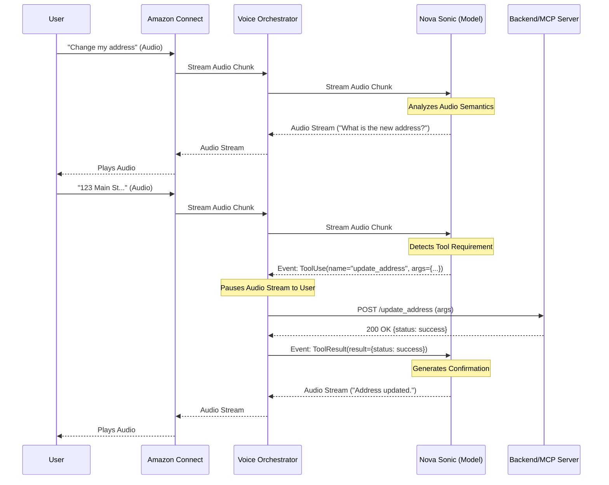

# Nova Sonic Intent Recognition & Fulfillment Flow

## Overview
Unlike traditional slot-filling bots (like Amazon Lex) that rely on pre-defined utterances and rigid state machines, **Amazon Nova Sonic** utilizes a **Generative AI "Audio-to-Action"** paradigm. It understands intent semantically from the raw audio stream and executes fulfillment through **Tool Use (Function Calling)**.

This document details how Nova Sonic handles a complex transactional request—changing a user's address—by integrating with backend systems (or MCP Servers) via the Voice Orchestrator.

## Complete System Architecture

The following diagram illustrates the end-to-end hybrid architecture, highlighting the parallel paths for Text (Lex) and Voice (Nova Sonic), the unified Guardrails, and the Feedback Loop components.

```text
+-----------------------------------------------------------------------------------------------+
|                                   AWS Cloud Environment                                       |
+-----------------------------------------------------------------------------------------------+
|                                                                                               |
|   +--------+                                +------------------+                              |
|   |  User  |<==========================>    |  Amazon Connect  |                              |
|   +--------+       Voice / Chat             +---------+--------+                              |
|                                                       |                                       |
|                                                       | Routing                               |
|                                                       v                                       |
|                                             +---------+--------+                              |
|                                             |   Contact Flow   |                              |
|                                             +----+--------+----+                              |
|                                                  |        |                                   |
|                      Text Chat Path              |        |      Voice Path (Nova Sonic)      |
|               +----------------------------------+        +-----------------------------+     |
|               |                                                                         |     |
|               v                                                                         v     |
|      +--------+--------+                                                       +--------+-----+------+
|      |  Amazon Lex V2  |                                                       |    Voice Lambda     |
|      |   (NLU/Slots)   |                                                       | (Stream Orchestrator)|
|      +--------+--------+                                                       +--------+-----+------+
|               |                                                                         ^     |
|               v                                                                         |     |
|      +--------+--------+                                                                |     |
|      |   Chat Lambda   |                                                                |     |
|      |  (Fulfillment)  |                                                                |     |
|      +--------+--------+                                                                |     |
|               |                                                                         |     |
|               v                                                                         |     |
|      +--------+--------+        +---------------------+                        +--------+-----+------+
|      | Bedrock (Text)  |<------>|  Bedrock Guardrails |<---------------------->|     Nova Sonic      |
|      | (Claude Haiku)  |        | (Safety/Moderation) |                        |    (Audio Model)    |
|      +-----------------+        +---------------------+                        +---------------------+
|                                                                                               |
|                                                                                               |
|                                                                                               |
|      +-----------------+                                                                      |
|      | Backend / MCP   |<---------------------------------------------------------------------+
|      |    Servers      |          Tool Execution (GET/POST)                                   |
|      +-----------------+                                                                      |
|                                                                                               |
+-----------------------------------------------------------------------------------------------+
|                            Observability & Feedback Loop                                      |
+-----------------------------------------------------------------------------------------------+
|                                                                                               |
|  +--------------+       +--------------+        +--------------+        +------------------+  |
|  |  CloudWatch  |       |  S3 Bucket   |        |   DynamoDB   |        | Bedrock Training |  |
|  |     Logs     |       | (Audit/Logs) |<------>|  (Workflow)  |------->|   (Fine-Tuning)  |  |
|  +--------------+       +--------------+        +--------------+        +------------------+  |
|                                                                                               |
+-----------------------------------------------------------------------------------------------+
```

## The "Audio-to-Action" Paradigm

1.  **Semantic Intent Recognition**: Nova Sonic does not classify text into static intent categories (e.g., `ChangeAddressIntent`). Instead, it uses its LLM capabilities to understand the *meaning* of the user's speech in context.
2.  **Dynamic Slot Elicitation**: If information is missing, the model naturally generates a follow-up question based on the tool definition, without needing a hardcoded dialogue flow.
3.  **Tool Execution**: When the model has sufficient information, it pauses audio generation and emits a structured **Tool Use Event**. The Orchestrator Lambda executes this tool and returns the result.

## Process Flow Example: "I want to change my address"

### Scenario
*   **User**: "I need to update my billing address."
*   **System**: Authenticates user, collects new address, updates backend via POST, and confirms.

### Step-by-Step Execution

#### 1. Intent Detection & Parameter Collection
*   **User Audio**: *"Hi, I moved recently and need to change my address."*
*   **Nova Sonic (Internal Thought)**: User wants to perform action `update_address`. I need `street`, `city`, `zip`.
*   **Nova Sonic (Audio Output)**: *"I can help with that. What is your new street address?"*
*   **User Audio**: *"It's 123 Main Street, Seattle."*
*   **Nova Sonic (Internal Thought)**: I have `street` ("123 Main Street") and `city` ("Seattle"). I still need `zip_code`.
*   **Nova Sonic (Audio Output)**: *"Got it. And the zip code?"*
*   **User Audio**: *"98101."*

#### 2. Tool Selection & Invocation
*   **Nova Sonic (Internal Thought)**: I have all required parameters for the `update_address` tool.
*   **Nova Sonic Action**: Stops generating audio. Emits a `ToolUse` event in the bidirectional stream.
    ```json
    {
      "type": "tool_use",
      "toolUseId": "tool_u12345",
      "name": "update_address",
      "input": {
        "street": "123 Main Street",
        "city": "Seattle",
        "zip_code": "98101"
      }
    }
    ```

#### 3. Orchestrator & MCP Execution
*   **Voice Orchestrator (Lambda)**:
    1.  Receives the `tool_use` event.
    2.  Maps `update_address` to a specific backend API or **MCP Server Tool**.
    3.  Executes the operation (e.g., `POST /api/customer/address`).
    4.  Receives response: `{"status": "success", "updated_at": "2025-12-01"}`.
    5.  Sends a `ToolResult` event back into the Nova Sonic stream.
    ```json
    {
      "type": "tool_result",
      "toolUseId": "tool_u12345",
      "content": [
        { "json": { "status": "success" } }
      ]
    }
    ```

#### 4. Final Confirmation
*   **Nova Sonic**: Receives the tool result.
*   **Nova Sonic (Audio Output)**: *"Done. I've updated your address to 123 Main Street, Seattle. Is there anything else?"*

## Sequence Diagram



## Hallucination Detection & Feedback Loop

To ensure continuous improvement and reliability, the architecture includes a closed-loop system for detecting, capturing, and mitigating hallucinations (incorrect or fabricated information).

### 1. Detection Mechanisms
*   **Real-time Guardrails**: Bedrock Guardrails intercept and block unsafe or off-topic content before it reaches the user.
*   **Tool Validation**: The Voice Orchestrator validates tool parameters against the schema. If Nova Sonic invents a parameter (e.g., `zip_code: "Mars"`), the validation fails, flagging a hallucination.
*   **Sentiment Analysis**: Amazon Connect Contact Lens monitors user sentiment. A sudden drop in sentiment often indicates the model is misunderstanding or hallucinating.
*   **User Correction**: If the user says "No, that's wrong," the transcript is tagged for review.

### 2. Capture & Logging Strategy (Hybrid S3 + DynamoDB)

While S3 is excellent for storage, **DynamoDB** is superior for managing the *workflow* of the feedback loop. A hybrid approach is recommended:

*   **S3 (Data Lake & Training Source)**:
    *   Stores the heavy "Evidence Package": Input Audio, Output Audio, and full JSON Prompt/Response logs.
    *   Acts as the direct input source for Bedrock Fine-Tuning jobs (which require JSONL files in S3).
*   **DynamoDB (Operational Metadata & Workflow)**:
    *   Stores the "Incident Record": `SessionID`, `Timestamp`, `ErrorType`, `ReviewStatus` (New/Reviewed/Corrected), and the `S3Path`.
    *   Allows SMEs to quickly query "All unreviewed hallucinations from today" without scanning thousands of S3 files.

**Why this is better than S3 alone:**
*   **Queryability**: DynamoDB allows instant filtering by error type or date.
*   **State Management**: You can track the lifecycle of a hallucination (New -> Corrected -> Added to Dataset).
*   **Fine-Tuning Readiness**: The corrected data in DynamoDB can be easily exported to generate the clean JSONL files required by Bedrock.

### 3. Feedback & Fine-Tuning Process
1.  **Log**: Voice Lambda detects anomaly -> Uploads payload to S3 -> Creates item in DynamoDB (Status: `NEW`).
2.  **Review**: SME dashboard queries DynamoDB -> Fetches audio from S3 -> SME listens and types the *correct* response.
3.  **Update**: SME saves correction -> DynamoDB item updated (Status: `CORRECTED`, `CorrectedOutput`: "...").
4.  **Training Data Gen**: A scheduled job scans DynamoDB for `CORRECTED` items -> Generates `training_data.jsonl` -> Uploads to S3.
5.  **Fine-Tuning**: Bedrock Fine-Tuning job is triggered using the S3 training file.

## ASCII Flow Diagram

```text
+--------+       +---------+       +--------------+       +------------+       +-------------+
|  User  |       | Connect |       | Voice Lambda |       | Nova Sonic |       | Backend/MCP |
+---+----+       +----+----+       +------+-------+       +------+-----+       +------+------+
    |                 |                   |                      |                    |
    | "Change addr"   |                   |                      |                    |
    +---------------->|                   |                      |                    |
    |   (Audio)       |   Stream Audio    |                      |                    |
    |                 +------------------>|    Stream Audio      |                    |
    |                 |                   +--------------------->|                    |
    |                 |                   |                      |                    |
    |                 |                   |                      | [Analyze Intent]   |
    |                 |                   |   "What address?"    |                    |
    |   "What addr?"  |   Stream Audio    |<---------------------+                    |
    |<----------------+<------------------+                      |                    |
    |                 |                   |                      |                    |
    | "123 Main St"   |                   |                      |                    |
    +---------------->|   Stream Audio    |                      |                    |
    |                 +------------------>|    Stream Audio      |                    |
    |                 |                   +--------------------->|                    |
    |                 |                   |                      |                    |
    |                 |                   |                      | [Extract Slots]    |
    |                 |                   |                      | {street, city...}  |
    |                 |                   |                      |                    |
    |                 |                   |      ToolUse Event   |                    |
    |                 |                   |<---------------------+                    |
    |                 |                   |                      |                    |
    |                 |                   | [Validate Params]    |                    |
    |                 |                   |--------------------->| [Log Hallucination]|
    |                 |                   | (If Invalid)         | (If Validation Fail)
    |                 |                   |                      |                    |
    |                 |                   | POST /update_address |                    |
    |                 |                   +------------------------------------------>|
    |                 |                   |                      |                    |
    |                 |                   |       200 OK         |                    |
    |                 |                   |<------------------------------------------+
    |                 |                   |                      |                    |
    |                 |                   |   ToolResult Event   |                    |
    |                 |                   +--------------------->|                    |
    |                 |                   |                      |                    |
    |                 |                   |                      | [Gen Confirmation] |
    |                 |                   |   "Address Updated"  |                    |
    |   "Updated."    |   Stream Audio    |<---------------------+                    |
    |<----------------+<------------------+                      |                    |
    |                 |                   |                      |                    |
+---+----+       +----+----+       +------+-------+       +------+-----+       +------+------+
```

## Amazon Connect Contact Flow View

The Contact Flow in Amazon Connect serves as the entry point and orchestrator for the session. For the Nova Sonic solution, the flow is designed to be minimal, offloading the conversational logic to the Voice Orchestrator Lambda.

### Visual Flow Representation

```text
[Entry] -> [Logging Behavior: On] -> [Set Voice: Neural]
                   |
                   v
          [Check Contact Attributes] (Determine Channel/Intent)
                   |
        +----------+----------+
        |                     |
   [Text/Chat]           [Voice/Phone]
        |                     |
        v                     v
   [Get Customer Input]  [Start Media Streaming] (To Kinesis Video Streams)
   (Lex Bot Hook)             |
                              v
                         [Invoke AWS Lambda] (Voice Orchestrator)
                              |
                              v
                         [Loop / Wait] (Lambda manages conversation)
                              |
                              v
                         [Disconnect]
```

### Key Contact Flow Blocks

1.  **Start Media Streaming**:
    *   **Purpose**: Captures the raw audio stream from the caller.
    *   **Configuration**: Streams to Kinesis Video Streams (KVS). This ARN is passed to the Lambda.

2.  **Invoke AWS Lambda**:
    *   **Target**: `voice_orchestrator` function.
    *   **Parameters**: Passes `ContactId`, `MediaStreamArn`, and `CustomerPhoneNumber`.
    *   **Behavior**: The Lambda connects to Nova Sonic, manages the bidirectional audio stream, and executes tools. It keeps the Lambda running for the duration of the conversation (or until a pause/handoff).

3.  **Error Handling**:
    *   If the Lambda fails or Nova Sonic is unavailable, the flow routes to a standard **Play Prompt** ("Sorry, I'm having trouble...") and disconnects or transfers to an agent.

This design ensures that Amazon Connect handles the telephony (SIP/RTP) while Nova Sonic handles the intelligence and audio generation.

## Integration with MCP Servers

The **Voice Orchestrator Lambda** acts as the client for Model Context Protocol (MCP) servers.

1.  **Tool Definition**: When the session starts, the Lambda sends the available tools definition to Nova Sonic.
    ```json
    "tools": [
      {
        "name": "update_address",
        "description": "Updates the customer's billing address",
        "inputSchema": {
          "type": "object",
          "properties": {
            "street": { "type": "string" },
            "city": { "type": "string" },
            "zip_code": { "type": "string" }
          },
          "required": ["street", "city", "zip_code"]
        }
      }
    ]
    ```

2.  **Dynamic Routing**:
    *   **GET (Read)**: Used for tools like `get_account_balance` or `check_order_status`.
    *   **POST/PUT (Write)**: Used for tools like `update_address` or `submit_ticket`.
    
    The Lambda function parses the `toolUse` event name and routes it to the appropriate MCP server endpoint or internal API function.

## Implementation Details

### Infrastructure Components
The architecture is deployed via Terraform with the following key resources:

1.  **Voice Orchestrator Lambda** (`aws_lambda_function.voice_orchestrator`):
    *   **Role**: Manages the bidirectional stream with Nova Sonic and executes tools.
    *   **Environment Variables**:
        *   `MCP_FUNCTION_NAME`: The function name of the MCP Server Lambda (e.g., `connect-nova-sonic-hybrid-mcp-server`).
        *   `FEEDBACK_TABLE_NAME`: The DynamoDB table for tracking hallucinations (e.g., `connect-nova-sonic-hybrid-hallucination-feedback`).
        *   `GUARDRAIL_ID` / `GUARDRAIL_VERSION`: Bedrock Guardrail configuration.

2.  **MCP Server Lambda** (`aws_lambda_function.mcp_server`):
    *   **Role**: Simulates the backend system, handling tool execution requests.
    *   **Runtime**: Node.js 18.x.
    *   **Security**: Only invocable by the Voice Orchestrator Lambda via IAM permissions.

3.  **Feedback Loop DynamoDB** (`aws_dynamodb_table.hallucination_feedback`):
    *   **Role**: Stores hallucination events and feedback data.
    *   **Key Schema**: `SessionId` (Partition Key), `Timestamp` (Sort Key).
    *   **Encryption**: Server-side encrypted with AWS KMS.

### Security & Zero Trust
*   **Least Privilege**: The Voice Orchestrator IAM role (`lambda_voice_role`) is strictly scoped.
    *   `bedrock:InvokeModelWithResponseStream`: Allowed only for `amazon.nova-sonic-v1:0`.
    *   `lambda:InvokeFunction`: Allowed **only** for the specific MCP Server Lambda ARN.
    *   `dynamodb:PutItem`: Allowed **only** for the specific Feedback Loop table ARN.
*   **Encryption**: All data at rest (S3 Logs, DynamoDB Tables) is encrypted using a customer-managed KMS key (`aws_kms_key.log_key`).
